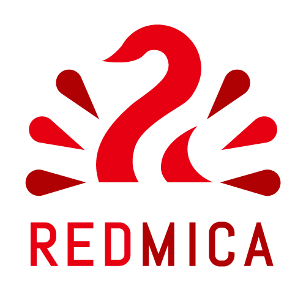

# RedMica logo

These are logos of [RedMica](https://github.com/redmica/redmica).

RedMica is a derived software of Redmine, an excellent project management software. See <https://github.com/redmica/redmica> for more details.

* Square: [EPS](redmica-logo.eps), [PNG large](redmica-logo-large.png), [PNG small](redmica-logo-small.png)
* Horizontal: [EPS](redmica-logo-horizontal.eps), [PNG large](redmica-logo-horizontal-large.png), [PNG small](redmica-logo-horizontal-small.png)
* Inverted: [EPS](redmica-logo-inverted.eps), [PNG large](redmica-logo-inverted-large.png), [PNG small](redmica-logo-inverted-small.png)

## Colors

* RedMica Red: #E60012 (CMYK: 0%, 100%, 100%, 0%)
* RedMica Wine Red: #AF0003 (CYMK: 0%, 100%, 100%, 34%)

## Font

The font used in the logo is [Abel](https://fonts.google.com/specimen/Abel).

## Conditions of use

This logo may be used for the following purposes. Any other use is subject to prior approval.

* To promote RedMica, RedMica based products or services, or related communities
* To mention RedMica in blog posts, news articles, or publications
* To express support for RedMica

## Copyright

Copyright (C) 2020 [Far End Technologies Corporation](https://www.farend.co.jp/)
